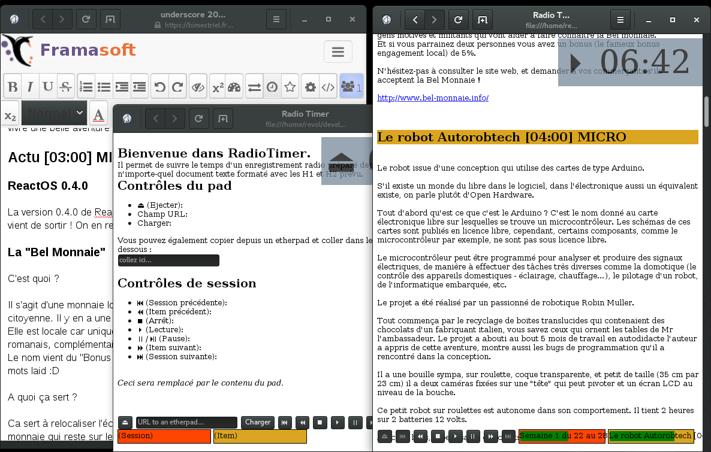

# RadioTimer 📻⏳
HTML5 time tracking for radio broadcast recording sessions

RadioTimer helps you see how far you are in your notes exported from an Etherpad instance, or any other text you paste to it that is formated with H1 and H2 tags.

Here you can see an Etherpad instance hosted by Framasoft, RadioTimer's default page, and a running instance on the exported etherpad content.

## Features

Automatically imports the pad content from URL (in some cases), or from pasted content.

It detects headings formated as such:

* H1 tags delimiting sessions

* H2 tags delimiting items and formated to include \[MM:SS\] time notation.

It then calculates total session time for each of them.

The timer at top-right tells you how much you've spent on the session, and switches to a redish background when you've passed the allocated time on an item (if paused) or the whole session.

The controls at the bottom of the page lets you navigate through sessions and items, and start/stop playing, and pausing (ie. staying on the current item even when time has passed, in case you are late).

The two progress bars indicates the current session and idem and the percentage of the time spent on them.

## Caveats

Directly importing from an etherpad URL doesn't work when running online (from an HTTP server) in some browsers (like Firefox) due to security restrictions (to prevent cross-site attacks). Running from local filesystem (file://) seems to work on the other hand.

You can still copy-paste the etherpad content, although it's less easy to use.

## TODO

- [x] some documentation.
- [x] count words automatically, estimate speaking time.
- [ ] warn on underestimated items.
- [ ] real prompter mode?
- [ ] allow using a synchronization API to automatically start multiple RadioTimer clients at the same time, cf [French article](https://blog.cloudfrancois.fr/synchroniser-une-presentation-slides-html-css-js-entre-plusieurs-navigateurs/).
- [ ] disable all #contents>A HREF onclick when playing to avoid accidentally replacing the page.
- [x] default contents and manual hidden and paste input field disabled in Safari and Android browser !?
- [ ] fix loading in Safari and Android browser
- [x] fix CSS positioning in Android browser
- [x] fix button glyphs in Safari (Unicode arrow)
- [ ] handle settings (cookie?): toolbar transparency, scroll on next item...
- [ ] profit!
